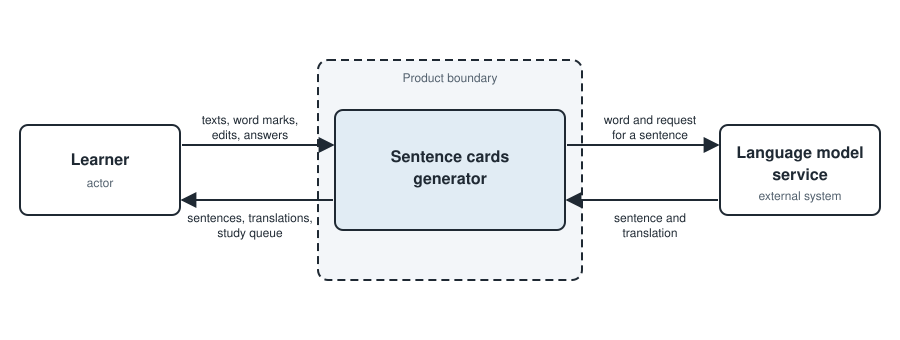

# Product vision

Sentence cards generator

## Goal

A learner who studies from texts they chose can turn the words they do not know into cards whose sentences they have checked, and study the words of one text first, without editing files by hand or leaving the product.

**Supports:** [VP-01](research/value-proposition.md#vp-01-an-editor-to-check-generated-sentences-before-you-study-them) and [VP-02](research/value-proposition.md#vp-02-the-learner-decides-which-words-come-first-without-losing-progress).

## Stakeholders

- **Learner** of Russian, English or German who studies from texts they chose: the primary user.
- **Teacher** who helps a learner and corrects the sentences and translations of the learner's cards (Customer, [00:05:38]): a user whose connection to the learner is still an open question.
- **Customer**: decides the scope, wants the product to be open source "so that others can contribute code or use it in their own language setting" (Customer, [00:00:00]), and may provide an API key for a cheap model (Customer, [00:17:50]).
- **Team** (`nataliamotand`, `AbdelrahmanAbdel-Aal`, `emapfff`): builds the product during the course.
- **Open source contributors and other learners** who run the product for their own language: affected by it without being asked what it should do.

## Constraints

### CON-01

The product is built and maintained by three people.

- **Status:** Active
- **Source:** Team-given
- **What it costs:** every part of the product has to be small enough for one person to own, so the editor and the study queue cannot both be large.

### CON-02

The product has to work by the code freeze on 26 November 2026, seven weeks after Week 2.

- **Status:** Active
- **Source:** Environmental
- **What it costs:** seven weeks, shared with the work each weekly assignment asks for, so no platform integrations and no full reader like [ALT-02](research/alternatives.md#alt-02-lingq), as the [gap analysis](research/gap-analysis.md#gaps-we-chose-not-to-pursue) records.

### CON-03

The content of the cards is in Russian, English and German.

- **Status:** Active
- **Source:** Customer-given
- **What it costs:** every check of sentence quality has to be repeated in three languages, as [ASM-01](assumptions.md#asm-01) says.

### CON-04

A free language model, or one cheap enough that the Customer can provide the key.

- **Status:** Active
- **Source:** Customer-given
- **What it costs:** weaker sentences, so the learner regenerates more often, as [VP-01](research/value-proposition.md#vp-01-an-editor-to-check-generated-sentences-before-you-study-them) says.
- **Decision:** [`DEC-003`](decisions.md#dec-003)

### CON-05

Review happens inside our app, so the learner does not need to import from Anki.

- **Status:** Active
- **Source:** Customer-given
- **What it costs:** we build our own spaced-repetition scheduling instead of reusing Anki's, as [VP-02](research/value-proposition.md#vp-02-the-learner-decides-which-words-come-first-without-losing-progress) says.
- **Decision:** [`DEC-002`](decisions.md#dec-002)

### CON-06

The code is open source.

- **Status:** Active
- **Source:** Customer-given
- **What it costs:** no key or private data can be committed to the repository, so the product reads its key from configuration.

### CON-07

The product runs on a VPS or on the learner's own machine, and the choice between the two is still open.

- **Status:** Active
- **Source:** Customer-given
- **What it costs:** we cannot assume an always-on server or files on the learner's machine until the Customer says which one.

## Boundary

### BND-01

Produce audio for the words and sentences.

- **Status:** Active
- **Handled by:** Nobody
- **Why:** free tools already cover audio, and the Customer uses one of them (Customer, [00:10:59]); the [gap analysis](research/gap-analysis.md#gaps-we-chose-not-to-pursue) records it as an extra rather than a differentiator, and it would compete with the core stories for the seven weeks in [`CON-02`](#con-02).

### BND-02

Import cards from Anki or keep the product in sync with an Anki collection.

- **Status:** Active
- **Handled by:** Nobody
- **Why:** the Customer called importing from Anki a nice-to-have (Customer, [00:21:50]), [`DEC-002`](decisions.md#dec-002) says it is not required, and [`CON-05`](#con-05) puts review inside our app; the [gap analysis](research/gap-analysis.md#gaps-we-chose-not-to-pursue) leaves it as a possible extra for later.

### BND-03

Fetch texts from video, streaming services or e-books.

- **Status:** Active
- **Handled by:** The learner, by hand: they paste or upload the text.
- **Why:** [`CON-02`](#con-02): seven weeks do not fit the platform integrations that [ALT-02](research/alternatives.md#alt-02-lingq) has.

### BND-04

Train or host a language model.

- **Status:** Active
- **Handled by:** Language model service
- **Why:** [`CON-04`](#con-04) asks for a free or cheap model, and [`CON-01`](#con-01) leaves nobody to run one.

## Context

The learner is the actor: they send texts, the words they mark, their edits and their answers, and receive sentences, translations and the study queue.
The language model service is the external system: the product sends it a word and receives a sentence and a translation.
The language model service is on the diagram because `BND-04` hands it the job of writing sentences, and the learner is on it because `BND-03` leaves the texts to them.
Nothing on the diagram does a job that `BND-01` or `BND-02` leaves to nobody.

## Where The Detail Lives

- [User stories](https://github.com/itpd-team-6/sentence-cards-generator-team-6/issues?q=label%3Auser-story)
