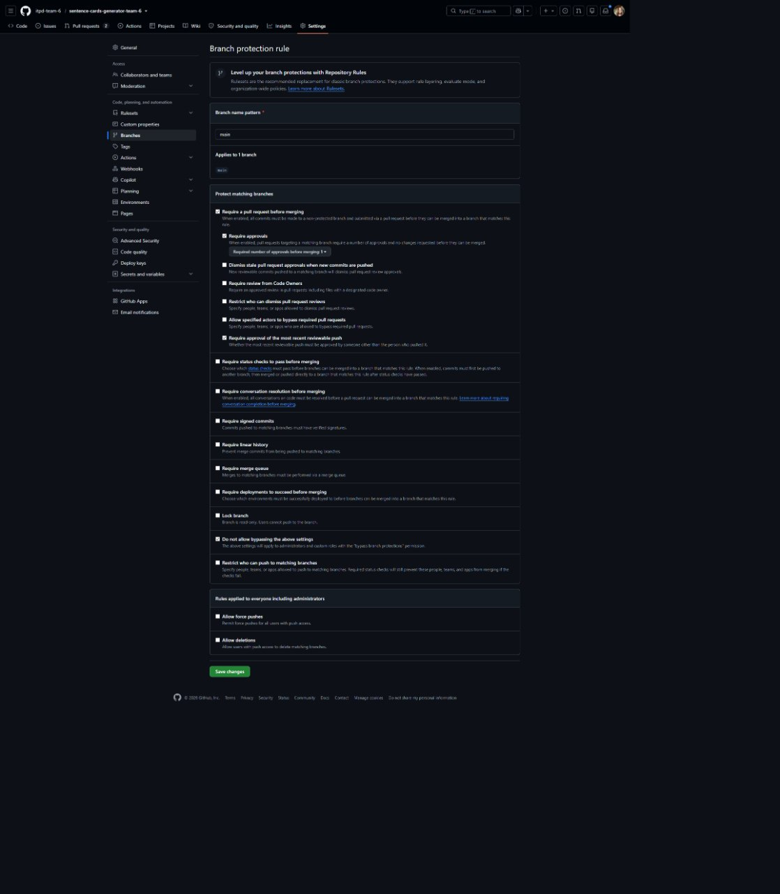

# Week 01 report

## Project

Sentence cards generator, team 6.
Licensed under [MIT](../../LICENSE).

Our problem-space sentence: language learners (and their teachers) who study Russian, English or German from real texts want to turn the words they choose into flashcards with example sentences, translations and pronunciation, and review them with spaced repetition, without building each card by hand.

## What we did

We listed 13 candidate products, researched four of them as alternatives (songs2anki, LingQ, Quizlet, and Anki with ChatGPT), compared them on eight properties, and found three gaps.
We held a kickoff with the Customer on 2026-09-30, which changed our proposed direction.

## Findings

Products that write new example sentences (songs2anki, ChatGPT) give the learner no simple way to check or fix them, and products that need no setup (LingQ, Quizlet) do not write new sentences at all.
Before the kickoff we planned to build around picking words in your own text (GAP-03); the Customer put an editor for generated sentences first, so our main proposition is now that editor ([VP-01](../../docs/research/value-proposition.md#vp-01-an-editor-to-check-generated-sentences-before-you-study-them)), with picking words as its first step, plus letting the learner choose which words come first ([VP-02](../../docs/research/value-proposition.md#vp-02-the-learner-decides-which-words-come-first-without-losing-progress)).
What is still open after the kickoff is listed in the meeting report's [open questions](meeting-report.md#open-questions).

## Coverage

| Deliverable              | Artifact                                                                                 |
| ------------------------ | ---------------------------------------------------------------------------------------- |
| Candidate list           | [candidate-list.md](candidate-list.md)                                                   |
| Alternatives search      | [docs/research/alternatives.md](../../docs/research/alternatives.md)                     |
| Compare the alternatives | [docs/research/comparison.md](../../docs/research/comparison.md)                         |
| Gap analysis             | [docs/research/gap-analysis.md](../../docs/research/gap-analysis.md)                     |
| Value proposition        | [docs/research/value-proposition.md](../../docs/research/value-proposition.md)           |
| Research board           | [Miro board](https://miro.com/app/board/uXjVHgAUe_0=/)                                   |
| Meeting script           | [meeting-script.md](meeting-script.md)                                                   |
| Customer kickoff         | [meeting-report.md](meeting-report.md), [meeting-transcript.md](meeting-transcript.md)   |
| AI usage                 | [ai-usage.md](ai-usage.md)                                                               |

The Customer permitted recording and publishing a sanitized transcript, so we produced a transcript rather than notes.

## Contribution

| Member               | Work                                                                                                                       |
| -------------------- | -------------------------------------------------------------------------------------------------------------------------- |
| nataliamotand        | Repository setup ([PR #1](https://github.com/itpd-team-6/sentence-cards-generator-team-6/pull/1)), alternatives skeleton ([PR #2](https://github.com/itpd-team-6/sentence-cards-generator-team-6/pull/2)), meeting script ([PR #3](https://github.com/itpd-team-6/sentence-cards-generator-team-6/pull/3)), transcript and board link ([PR #7](https://github.com/itpd-team-6/sentence-cards-generator-team-6/pull/7)), ALT-01, ALT-02, comparison, gap analysis, value proposition, meeting report and this report ([PR #9](https://github.com/itpd-team-6/sentence-cards-generator-team-6/pull/9)); interviewer at the kickoff; reviewed and approved [PR #4](https://github.com/itpd-team-6/sentence-cards-generator-team-6/pull/4) and [PR #6](https://github.com/itpd-team-6/sentence-cards-generator-team-6/pull/6) |
| AbdelrahmanAbdel-Aal | Candidate list ([PR #4](https://github.com/itpd-team-6/sentence-cards-generator-team-6/pull/4)), ALT-03 and ALT-04 ([PR #6](https://github.com/itpd-team-6/sentence-cards-generator-team-6/pull/6)); note taker and observer at the kickoff; reviewed and merged [PR #1](https://github.com/itpd-team-6/sentence-cards-generator-team-6/pull/1), [PR #2](https://github.com/itpd-team-6/sentence-cards-generator-team-6/pull/2), [PR #3](https://github.com/itpd-team-6/sentence-cards-generator-team-6/pull/3) |
| emapfff              | Branch protection screenshot ([PR #8](https://github.com/itpd-team-6/sentence-cards-generator-team-6/pull/8)); reviewed [PR #7](https://github.com/itpd-team-6/sentence-cards-generator-team-6/pull/7) |

## Repository evidence

- Branch protection on `main`: 
- A merged pull request approved by another member: [PR #4](https://github.com/itpd-team-6/sentence-cards-generator-team-6/pull/4), approved by nataliamotand.
- The latest green link check on `main`: [link check runs on `main`](https://github.com/itpd-team-6/sentence-cards-generator-team-6/actions/workflows/lychee.yml?query=branch%3Amain).
- Excluded links, in [.lycheeignore](../../.lycheeignore): `quizlet.com` and `chatgpt.com` return 403 to the link checker, and pages of the `deemp/songs2anki` repository on GitHub intermittently return 503; we opened all of them in a browser on 2026-09-30, 2026-10-01 and 2026-10-02 and they work.

## Deviations

- The kickoff started on Google Meet and moved to Kontur Talk after connection problems; the recording starts during the Customer's answer to the first question, so our presentation and the three permission questions are not on it (the answers are in the [meeting report](meeting-report.md#metadata)).
- emapfff joined the team on 2026-09-29, was on the Google Meet call, and could not rejoin after the move to Kontur Talk.
- The action points in the meeting report were set by the team after the meeting, because none were agreed during it.

## Privacy

No private-only material was committed to this repository.
